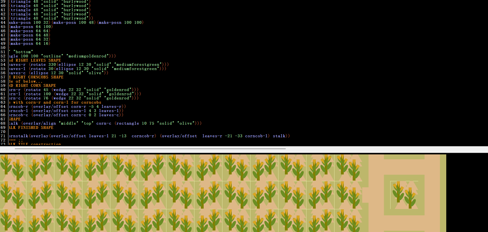

# SCHEME REPO README

Inside this repo are LISP/Scheme/Racket based projects.

#### Inside:

- [Helper Library](#Scheme-Helper-Library)
- [Corn Maze](#Corn-Maze)

# Corn Maze

This project uses Racket's `2htdp/image` library to construct a stylized tile-based corn maze. It combines geometric primitives and image composition to build a customized system for maze generation.

## TODO

Planned features for future development:

- [ ] **Avatar System**  
       Implement player avatar.

- [ ] **Key Events**  
       Add keyboard controls for movement, interaction, and navigation.

- [ ] **Scoring Mechanism**  
       Create Scoring system to track player progress, rewards, and penalties based on maze traversal.

- [ ] **Event/Story System**  
       Create State management to create a story based experience and create future RPG ELEMENTS.

- [ ] **Leveling System**  
       Introduce experience points and progression mechanics.

- [ ] **RPG Elements**  
       Add inventory, stats, dialogue, and quest-like interactions.

# Scheme Helper Library

A collection of files and functionality to use in scheme.
This is an exercise in learning the language and also practicing what i am reading in [SICP](https://sarabander.github.io/sicp/html/index.xhtml).

Below is my comprehensive wish list.

---

## Core Implemented

- [x] `length` — recursive list length
- [x] `list-map` — apply function to each element
- [x] `list-filter` — return only elements satisfying predicate
- [x] `list-append` — concatenate two lists
- [x] `list-reduce` — left-associative reduction
- [x] `word` — combine strings/symbols into one
- [x] `first`, `bf`, `every` — shorthand SICP/Logo-inspired helpers

---

## Phase 1: List and Sequence Enhancements

Expanding foundational list tools to form a complete functional toolkit.

### Functional Primitives

- [ ] `list-foldl` / `list-foldr` — fold variants with accumulator
- [ ] `list-sum` / `list-product` — reduce helpers
- [ ] `list-reverse` — iterative and recursive versions
- [ ] `list-flatten` — recursively flatten nested lists
- [ ] `list-unique` — remove duplicates
- [ ] `list-take` / `list-drop` — split lists by index
- [ ] `list-zip` / `list-unzip` — combine or separate parallel lists
- [ ] `list-any?` / `list-all?` — test if any/all elements satisfy predicate
- [ ] `list-partition` — split list by predicate

### Stretch Goals

- [ ] Implement tail-recursive versions for performance
- [ ] Benchmark recursive vs tail-recursive functions

---

## Phase 2: String, Symbol, and Word Utilities

Enhancing manipulation of text, symbols, and “words” in SICP-style exercises.

- [ ] `symbol-append` — join symbols directly
- [ ] `string-split` — split string into list of substrings
- [ ] `string-join` — inverse of split
- [ ] `starts-with?` / `ends-with?` — string predicates
- [ ] `char-list->string` / `string->char-list` — conversions
- [ ] `word?` — type predicate for “word” symbols
- [ ] `sentence` — build list-like sentence structure `(sentence 'hello 'world) -> '(hello world)`

---

## Phase 3: Math and Functional Abstractions

General-purpose higher-order tools and math helpers used in functional coursework.

- [ ] `compose` — `(compose f g)` → `(lambda (x) (f (g x)))`
- [ ] `curry` / `uncurry` — argument manipulation
- [ ] `identity`, `const`, `flip` — basic combinators
- [ ] `range` — generate numeric sequence `(range 1 5)` → `(1 2 3 4 5)`
- [ ] `repeat` — apply a function N times
- [ ] `accumulate` — generalized summation/product builder
- [ ] `zip-with` — zip lists with a combining function

---

## Phase 4: Utility and Testing Tools

Improving maintainability, debugging, and correctness verification.

- [ ] `assert` macro — check expected results
- [ ] `displayln` wrapper — formatted output
- [ ] `trace-call` — debugging recursion visualization
- [ ] Mini test suite:

  - [ ] `(check-equal? (length '(1 2 3)) 3)` style assertions
  - [ ] Auto-run test summary

---

## Phase 5: Educational and Visualization Tools

Helpers for understanding recursion and data structures.

- [ ] `draw-recursion` — visualize recursion depth
- [ ] `print-list-tree` — pretty-print nested lists
- [ ] `trace-reduce` — show intermediate reductions
- [ ] `call-count` — count recursive calls

---

## Phase 6: UC Berkeley CS 61A Coursework Functions

Commonly used functions and helpers for compatibility with 61A assignments.

### Accessors and Predicates

- [ ] `empty?` — alias for `(null? lst)`
- [ ] `last` — last element of list
- [ ] `butlast` — all but last element
- [ ] `member?` — test if element is in list
- [ ] `count` — count elements satisfying predicate

### Constructive List Helpers

- [ ] `reverse` — return reversed copy
- [ ] `flatten` — flatten nested lists (used in symbolic problems)
- [ ] `zip` / `unzip` — combine or separate lists
- [ ] `range` — numeric sequence generator (often used in labs)

### Higher-Order Functions

- [ ] `compose` — function composition
- [ ] `curry` / `uncurry` — argument manipulation
- [ ] `repeated` — apply function repeatedly
- [ ] `identity` — return argument unchanged

### Numeric and Accumulation Utilities

- [ ] `accumulate` — general summation/product builder
- [ ] `sum` / `product` — simplified accumulate wrappers
- [ ] `average` — mean of list
- [ ] `count-change` — classic recursive example

### Symbolic and Word Helpers

- [ ] `atom?` — true if not a list
- [ ] `pair?` — true if cons pair
- [ ] `equal?` — deep equality
- [ ] `assoc` — find pair in association list

### Utility and Testing Aids

- [ ] `print` / `displayln` — debugging output
- [ ] `assert-equal` — lightweight testing
- [ ] `trace` — print recursive calls for learning

### Optional Logo Compatibility Layer

For older 61A/SICP materials or Dr. Racket’s “SICP” language:

- [ ] `first`, `butfirst`
- [ ] `last`, `butlast`
- [ ] `sentence`, `word`, `item`, `count`

---

## Phase 7: Future Ideas

- [ ] Port to R5RS-compatible Scheme for portability
- [ ] Add memoization utilities for recursion optimization
- [ ] Build interactive REPL helpers for visualization
- [ ] Package as a Racket Teachpack (`(require sicp-helpers)`)

---

**Author:** Joseph D’Amato
**Purpose:** To build a comprehensive Scheme helper library inspired by SICP and UC Berkeley CS 61A.
**Goal:** Support learning, experimentation, and elegant recursive programming while maintaining full 61A coursework compatibility.
